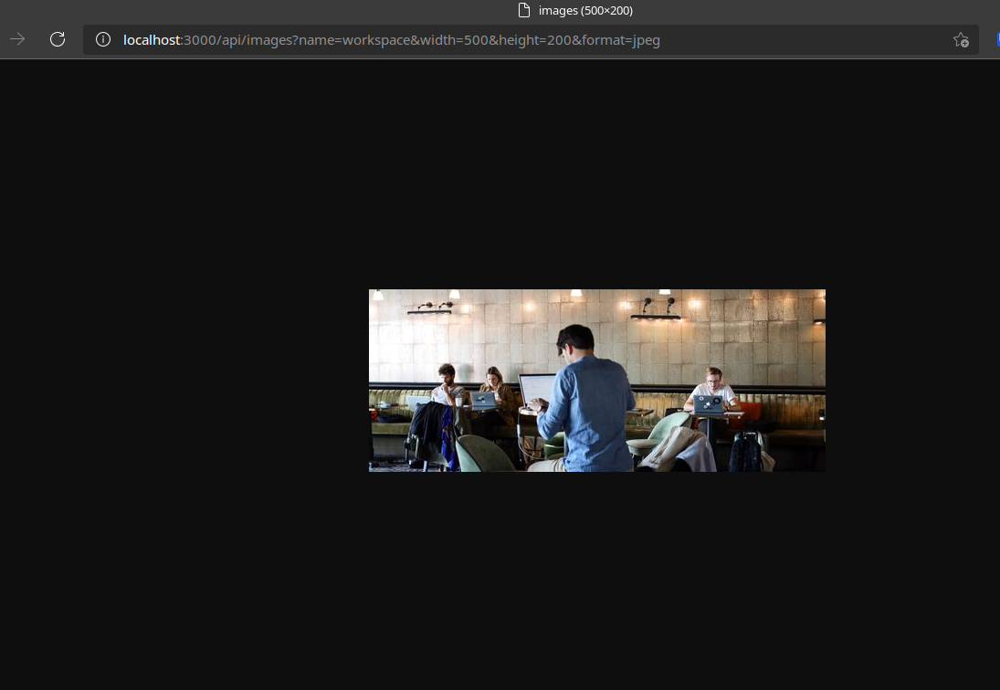

# Image Processing API

An image processing API build to be used as a placeholder for images in any site or to process images to specific dimensions and formats using sharp.

## Technologies Used:

1. Express JS
2. Sharp
3. Typescript
4. Jasmine
5. Supertest
6. Prettier and ESLINT

## How to setup:

1. Clone the repository into your local machine

```
$ git clone https://github.com/MahmoudAshraf25/udacity-image-api.git
```

2. Install the dependencies using NPM

```
npm install
```

3. You can run the development server using:

```
npm run dev
```

or run the production build using:

```
npm run build
npm run start
```

4.  To run unit-tests use:

```
npm run test
```

## How to use:

- Get a full size image by providing a name query to /`api/images`

```
http://localhost:3000/api/images?name=astronaut

# Available names:

1) apartment
2) astronaut
3) book
4) workspaces

more can be added to /public/images/full
```

- Get image with specific width, height, and format

```
http://localhost:3000/api/images?name=workspace&width=500&height=200&format=jpeg

Replace width, height, format accordingly
```

## Key features:

1. Written in typescript
2. Offers flexible image resizing using sharp
3. Offer a variety of image formats such as Webp for better performance
4. Developed using Test-driven method to ensure predicted outcomes
